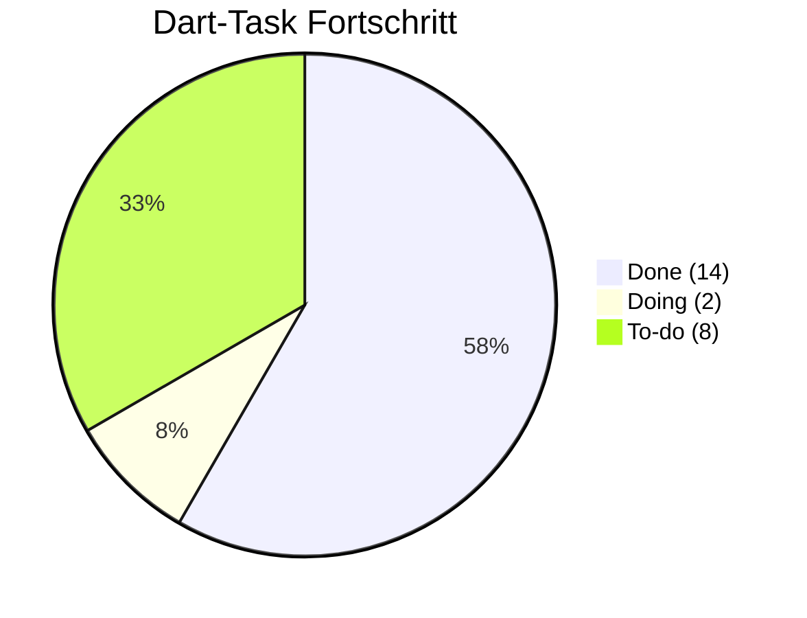

"""
Author: rahn
Datum: 08.02.2026
Version: 1.0
Beschreibung: Agenten-Uebersicht und Dart-Task-Status des AgentSmith Multi-Agent POC
"""

# AgentSmith - Agenten & Projektstatus

> Dieses Dokument zeigt alle Agenten des Systems und den aktuellen Dart-Task-Status.
> Prozessdiagramme (Hauptprozess, DevLoop, Quality Gates, Modell-Routing): siehe [workflow_diagram.md](workflow_diagram.md)

---

## 1. Agenten-Uebersicht

Alle Agenten des Systems, gruppiert nach Kategorie. Gruen = implementiert, Gelb = in Arbeit, Grau = geplant.

```mermaid
flowchart LR
    subgraph CORE[Core Development]
        style CORE fill:#1a3a1a,color:#fff
        C1[Coder Agent<br>Code-Generierung]:::done
        C2[Reviewer Agent<br>Code-Review]:::done
        C3[Tester Agent<br>4 Module: Playwright,<br>Desktop, CLI, PyQt]:::done
        C4[Security Agent<br>The Guardian<br>OWASP Top 10]:::done
        C5[Designer Agent<br>UI/UX Konzept]:::done
    end

    subgraph ARCH[Architektur]
        style ARCH fill:#1a2a3a,color:#fff
        A1[TechStack Architect<br>Blueprint + Templates]:::done
        A2[DB Designer<br>Schema + ERD]:::done
        A3[Planner Agent<br>File-by-File Tasks]:::done
        A4[Konzepter Agent<br>Features + User Stories]:::done
        A5[Orchestrator Agent<br>Regelkonformitaet]:::done
    end

    subgraph INFRA[Infrastruktur]
        style INFRA fill:#2a2a1a,color:#fff
        I1[Model Architect<br>Modell-Auswahl 50+]:::done
        I2[Dependency Agent<br>5 Submodule]:::done
        I3[Docker Agent<br>Container-Setup]:::done
        I4[Fix Agent<br>Gezielte Patches]:::done
        I5[Memory Agent<br>Lernschleife]:::doing
    end

    subgraph SUPPORT[Support]
        style SUPPORT fill:#1a2a2a,color:#fff
        S1[Researcher Agent<br>DuckDuckGo]:::done
        S2[Documentation Manager<br>README + API-Docs]:::doing
        S3[Reporter Agent<br>Berichterstattung]:::done
        S4[Validator Agent<br>Validierung]:::done
    end

    subgraph EXTERN[Externe Spezialisten]
        style EXTERN fill:#2a1a2a,color:#fff
        E1[CodeRabbit<br>Code Review Advisory]:::done
        E2[Exa Search<br>Tech-Recherche]:::done
        E3[Augment Context<br>Code-Analyse CLI]:::done
    end

    subgraph PLANNED[Geplant / To-do]
        style PLANNED fill:#333,color:#999
        P1[Data Engineer Agent<br>ETL-Pipelines]:::todo
        P2[Data Analyst Agent<br>Statistik + Viz]:::todo
        P3[DevOps Agent<br>CI/CD + Deployment]:::todo
        P4[Visualizer Agent<br>Charts + Infografiken]:::todo
        P5[Domain-Experten-System<br>Dynamische Fachagenten]:::todo
        P6[Konsens-Engine<br>3-Stufen-Abstimmung]:::todo
    end

    CORE --> |generiert Code| ARCH
    ARCH --> |definiert Struktur| INFRA
    INFRA --> |verwaltet Abhaengigkeiten| SUPPORT
    SUPPORT --> |liefert Kontext| EXTERN

    classDef done fill:#2d5016,color:#fff,stroke:#4a8c2a
    classDef doing fill:#8b7d00,color:#fff,stroke:#c4b200
    classDef todo fill:#444,color:#999,stroke:#666
```

---

## 2. Agenten-Detail-Tabelle

| Kategorie | Agent | Datei | Modell-Rolle | Funktion |
|-----------|-------|-------|-------------|----------|
| **Core** | Coder | agents/coder_agent.py | coder | Code-Generierung, ### FILENAME Format |
| **Core** | Reviewer | agents/reviewer_agent.py | reviewer | Code-Review, Root-Cause-Format |
| **Core** | Tester | agents/tester_agent.py | tester | UI-Tests (Playwright, Desktop, CLI, PyQt) |
| **Core** | Security | agents/security_agent.py | security | OWASP Top 10, VULNERABILITY-FIX-SEVERITY |
| **Core** | Designer | agents/designer_agent.py | designer | Farben, Typography, Layout |
| **Architektur** | TechStack | agents/techstack_architect_agent.py | techstack | Blueprint + Template-Matching |
| **Architektur** | DB Designer | agents/database_designer_agent.py | db_designer | Schema + ERD |
| **Architektur** | Planner | agents/planner_agent.py | planner | File-by-File Task-Zerlegung |
| **Architektur** | Konzepter | agents/konzepter_agent.py | konzepter | Feature-Extraktion, User Stories |
| **Architektur** | Orchestrator | agents/orchestrator_agent.py | orchestrator | Regelkonformitaet, Doku |
| **Infra** | Model Architect | agents/model_architect_agent.py | model_architect | Modell-Auswahl fuer 21+ Rollen |
| **Infra** | Dependency | agents/dependency_agent.py | dependency | 5 Submodule, Multi-Command |
| **Infra** | Docker | agents/docker_agent.py | docker | Container-Setup, Isolation |
| **Infra** | Fix | agents/fix_agent.py | fix | Gezielte Code-Patches |
| **Infra** | Memory | agents/memory_agent.py | memory | Lernschleife, Patterns |
| **Support** | Researcher | agents/researcher_agent.py | researcher | DuckDuckGo-Recherche |
| **Support** | Documentation | agents/documentation_manager_agent.py | documentation | README, API-Docs |
| **Support** | Reporter | agents/reporter_agent.py | reporter | Berichterstattung |
| **Support** | Validator | agents/validator_agent.py | validator | Validierung |
| **Extern** | CodeRabbit | external_specialists/ | - | Code Review Advisory |
| **Extern** | Exa Search | external_specialists/ | - | Tech-Recherche |
| **Extern** | Augment | external_specialists/augment_specialist.py | - | Code-Analyse CLI |
| **Geplant** | Data Engineer | - (geplant) | data_engineer | ETL-Pipelines |
| **Geplant** | Data Analyst | - (geplant) | data_analyst | Statistik + Visualisierung |
| **Geplant** | DevOps | - (geplant) | devops | CI/CD + Deployment |
| **Geplant** | Visualizer | - (geplant) | visualizer | Charts + Infografiken |
| **Geplant** | Domain-Experten | - (geplant) | dynamisch | Fachagenten nach Bedarf |
| **Geplant** | Konsens-Engine | - (geplant) | - | 3-Stufen-Abstimmung |

---

## 3. Dart AI Task-Status

Vollstaendige Uebersicht aller 24 Subtasks des Haupttasks "Agent Smith - Multi-Agenten System fuer autonome Projektarbeit".

| # | Task | Status | Prioritaet | Tags |
|---|------|--------|-----------|------|
| 1 | Agenten-Katalog finalisieren | Done | High | AI, planning |
| 2 | Kommunikationsprotokoll definieren | Done | High | AI, architecture |
| 3 | OpenRouter-Integration testen | Done | Medium | AI, API, Testing |
| 4 | Minimal Viable System (MVP) bauen | Done | High | AI, Automation, Core |
| 5 | Discovery Session implementieren | Done | High | AI, Core, Feature |
| 6 | Security Agent implementieren | Done | High | AI, Security, agent |
| 7 | TechStack Architect implementieren | Done | High | AI, architecture |
| 8 | Database Designer implementieren | Done | Medium | AI, database |
| 9 | Test Generator implementieren | Done | High | AI, Testing |
| 10 | Model Architect implementieren | Done | High | AI, architecture |
| 11 | Dependency Agent implementieren | Done | High | AI, Core |
| 12 | Fix Agent implementieren | Done | High | AI, Core |
| 13 | External Bureau implementieren | Done | Medium | AI, Feature |
| 14 | Feature-Ableitung implementieren | **Doing** | High | AI, Core, planning |
| 15 | Dokumentation & Memory System | **Doing** | High | AI, Core, memory |
| 16 | Validierung am Waldruhe-Beispiel | To-do | Medium | Data, Testing |
| 17 | Konsens-Mechanismus implementieren | To-do | High | AI, Core, architecture |
| 18 | Tool-Integrationen (SonarQube, Snyk, GitHub Actions) | To-do | Medium | AI, Feature, Testing |
| 19 | Data Engineer Agent implementieren | To-do | Medium | AI, Data |
| 20 | Data Analyst Agent implementieren | To-do | Medium | AI, Data |
| 21 | DevOps Agent vollstaendig implementieren | To-do | Medium | AI, DevOps |
| 22 | Visualizer Agent implementieren | To-do | Low | AI, Feature |
| 23 | Domain-Experten-System (Grundstruktur) | To-do | Low | AI, Core, memory |
| 24 | Gamification-Oberflaeche | To-do | Low | Bonus, Feature, UI |

**Zusammenfassung:** 14 Done (58%) | 2 Doing (8%) | 8 To-do (33%)

---

## 4. Modell-Tier-Uebersicht

| Tier | Beschreibung | Beispiel-Modelle |
|------|-------------|------------------|
| **Test** | Free Tier, schnell, teils unreliable | llama-3.3-70b, deepseek-r1, gpt-oss-120b |
| **Production** | Mid Tier, Paid, zuverlaessig | kimi-k2.5, deepseek-r1-0528, gemini-2.5-flash |
| **Premium** | Enterprise, State-of-Art | gpt-5.2-high, claude-opus-4.6, deepseek-v3.2 |

### Pro-Agent Timeouts

| Agent | Default Timeout | Grund |
|-------|----------------|-------|
| default | 300s | Standard |
| coder | 600s | Groessere Code-Ausgaben |
| reviewer | 450s | Gruendliche Analyse |
| security | 1200s | Reasoning-Modell, >750s Kaltstart |
| tester | 900s | UI-Tests mit Playwright |

---

*Erstellt am 08.02.2026 | Version 1.0 | AgentSmith Multi-Agent POC*
