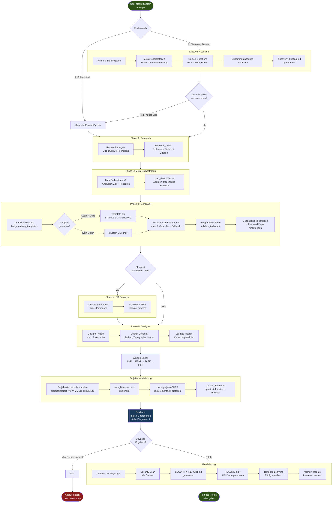
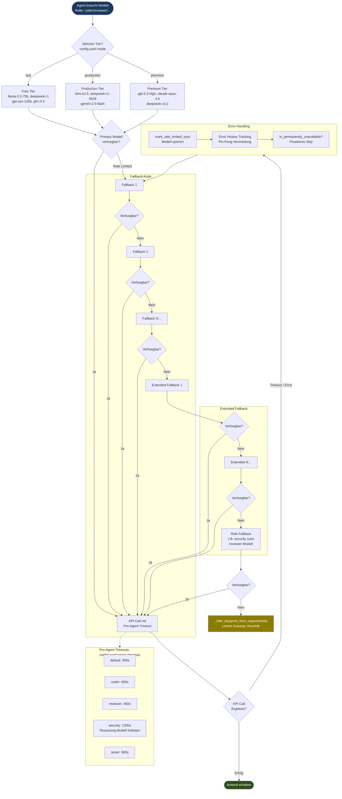

"""
Author: rahn
Datum: 08.02.2026
Version: 1.0
Beschreibung: Vollstaendiges Prozessdiagramm des AgentSmith Multi-Agent POC
"""

# AgentSmith - Vollstaendiger Workflow

> Dieses Dokument bildet den kompletten Prozess des AgentSmith Multi-Agent Systems grafisch ab.
> Alle Diagramme sind im Mermaid-Format und koennen in VS Code (Mermaid Preview), GitHub oder auf [mermaid.live](https://mermaid.live) gerendert werden.

---

## 1. Hauptprozess End-to-End

Der komplette Ablauf von User-Input bis fertiges Projekt in 6 Hauptphasen.



---

## 2. DevLoop - Detailansicht (Das iterative Herz)

Der vollstaendige iterative Entwicklungszyklus mit allen Entscheidungspunkten, Validatoren und Fallback-Mechanismen.

```mermaid
flowchart TD
    LOOP_START([Iteration i = 0]) --> CHECK_MAX{i < max_retries<br>Default: 50?}
    CHECK_MAX -->|Nein| MAX_FAIL([ABBRUCH:<br>Max Retries erreicht])
    CHECK_MAX -->|Ja| FBF_CHECK

    %% --- FILE-BY-FILE ENTSCHEIDUNG ---
    FBF_CHECK{File-by-File?<br>>10 Dateien oder >50KB} -->|Ja| FBF_PLAN
    FBF_CHECK -->|Nein| PROMPT_BUILD
    FBF_PLAN[Planner Agent<br>zerlegt in File-Tasks] --> FBF_EXEC[ThreadPoolExecutor<br>parallele Generierung]
    FBF_EXEC --> PROMPT_BUILD

    %% --- CODER-PROMPT AUFBAU ---
    subgraph PROMPT[Coder-Prompt Aufbau]
        PROMPT_BUILD[build_coder_prompt] --> P1[Tech-Blueprint +<br>DB-Schema]
        P1 --> P2[Design Concept<br>vom Designer - Pflicht!]
        P2 --> P3[Anti-Pattern-Regeln<br>20+ Regeln]
        P3 --> P4[Security-Regeln<br>OWASP Top 10]
        P4 --> P5[Template-Config-Schutz<br>Nicht ueberschreiben!]
        P5 --> P6[Feedback aus<br>vorheriger Iteration]
        P6 --> P7[UTDS Fix-Tasks<br>falls vorhanden]
    end

    P7 --> CODER

    %% --- CODER AGENT ---
    CODER[Coder Agent<br>LLM API Call<br>mit max_tokens + Timeout] --> SAVE

    %% --- SAVE & POST-PROCESSING ---
    subgraph SAVE_BLOCK[Code speichern + Post-Processing]
        SAVE[save_coder_output] --> PARSE[Parse Regex:<br>### FILENAME: path/file]
        PARSE --> SANITIZE[Sanitize Filenames<br>Path Traversal Check]
        SANITIZE --> STRIP_MARKERS[Sprach-Marker entfernen<br>```js, ```python etc.]
        STRIP_MARKERS --> DEP_CHECK{_is_dependency_file?<br>package.json /<br>requirements.txt}
        DEP_CHECK -->|Ja| DEP_MERGE[dependency_merger.merge<br>Template + Coder mergen<br>pinned > existierend > neu]
        DEP_CHECK -->|Nein| CONFIG_CHECK
        DEP_MERGE --> CONFIG_CHECK
        CONFIG_CHECK{_is_protected_config?<br>tailwind.config.js<br>postcss.config.js etc.}
        CONFIG_CHECK -->|Ja| SKIP_FILE[SKIP:<br>Nicht ueberschreiben]
        CONFIG_CHECK -->|Nein| WRITE_FILE[Datei schreiben<br>safe_join_path + makedirs]
        SKIP_FILE --> NORM
        WRITE_FILE --> NORM
        NORM[_normalize_package_json_versions<br>^ und ~ strippen]
    end

    NORM --> TRUNC_CHECK

    %% --- TRUNCATION ---
    TRUNC_CHECK{Truncation<br>erkannt?} -->|Ja| TRUNC_COUNT{Truncation<br>Versuch < 2?}
    TRUNC_CHECK -->|Nein| REBUILD
    TRUNC_COUNT -->|Ja| TRUNC_REGEN[Regeneriere nur<br>abgeschnittene Dateien] --> SAVE
    TRUNC_COUNT -->|Nein| REBUILD

    %% --- PATCHMODE ---
    REBUILD[rebuild_current_code_from_disk<br>PatchMode: Disk = Source of Truth]

    REBUILD --> SANDBOX_BLOCK

    %% --- SANDBOX & TESTS ---
    subgraph SANDBOX_BLOCK[Sandbox & Tests]
        direction TB
        SRV_CHECK{requires_server?} -->|Ja| SRV_START
        SRV_CHECK -->|Nein| TEST_GEN_CHECK

        subgraph SRV_START[Server starten]
            SRV1[npm install / pip install] --> SRV2[Framework-Timeout<br>FRAMEWORK_STARTUP_TIMEOUTS]
            SRV2 --> SRV3[Port-Detection<br>detect_server_port]
            SRV3 --> SRV4[Health-Check<br>Port offen + HTTP 200]
        end

        SRV_START --> TEST_GEN_CHECK

        TEST_GEN_CHECK{Iteration == 0?} -->|Ja| TEST_GEN
        TEST_GEN_CHECK -->|Nein| TEST_EXEC
        TEST_GEN[Test Generator Agent<br>Unit Tests generieren] --> TEST_EXEC

        subgraph TEST_EXEC[Tests ausfuehren]
            TE1{Sprache?}
            TE1 -->|Python| TE_PY[pytest]
            TE1 -->|Node| TE_JS[npm test]
            TE_PY --> TE_UI
            TE_JS --> TE_UI
            TE_UI[Tester Agent<br>UI-Tests via Playwright]
        end

        TEST_EXEC --> CONTENT_VAL

        subgraph CONTENT_VAL[Content-Validierung<br>7 Validatoren]
            CV1[validate_run_bat]
            CV2[validate_nextjs_structure]
            CV3[validate_import_dependencies]
            CV4[validate_template_structure]
            CV5[validate_no_inline_svg]
            CV6[validate_no_pages_router]
            CV7[validate_no_better_sqlite3]
        end
    end

    CONTENT_VAL --> HARMLESS

    %% --- WARNING FILTER ---
    HARMLESS{_is_harmless_warning_only?<br>pip root, npm audit,<br>pip upgrade notice} -->|Ja - nur Warning| REVIEW_BLOCK
    HARMLESS -->|Nein - echte Fehler| REVIEW_BLOCK

    %% --- REVIEW PHASE ---
    subgraph REVIEW_BLOCK[Review Phase]
        REV[Reviewer Agent<br>Code + Sandbox + Tests] --> REV_OUT{Review Verdict?}
        REV_OUT -->|OK| VIER_CHECK{Vier-Augen-Prinzip<br>enabled?}
        REV_OUT -->|ERRORS mit<br>Root-Cause-Format| REV_FAIL[review_verdict = ERRORS<br>URSACHE + DATEIEN + LOESUNG]

        VIER_CHECK -->|Ja| SECOND[Second Opinion Reviewer<br>anderes Modell, Timeout x0.5]
        VIER_CHECK -->|Nein| REV_OK[review_verdict = OK]

        SECOND --> SECOND_OUT{Second Opinion?}
        SECOND_OUT -->|Einig: OK| REV_OK
        SECOND_OUT -->|Dissent| DISSENT[Dissent loggen<br>vier_augen.log_dissent]
        DISSENT --> REV_FAIL
    end

    REV_OK --> SEC_BLOCK
    REV_FAIL --> SEC_BLOCK

    %% --- SECURITY RESCAN ---
    subgraph SEC_BLOCK[Security Rescan]
        SEC[Security Agent<br>The Guardian] --> SEC_PARSE[extract_vulnerabilities<br>VULNERABILITY - FIX - SEVERITY]
        SEC_PARSE --> SEC_OUT{Ergebnis?}
        SEC_OUT -->|SECURE| SEC_PASS[security_passed = true]
        SEC_OUT -->|Vulnerabilities| SEC_FAIL[security_passed = false<br>mit Dateinamen!]
    end

    %% --- HAUPTENTSCHEIDUNG ---
    SEC_PASS --> DECISION
    SEC_FAIL --> DECISION
    REV_FAIL --> DECISION

    DECISION{Gesamtergebnis?}
    DECISION -->|review=OK AND<br>security=passed| SUCCESS([ERFOLG!<br>DevLoop beendet])
    DECISION -->|Fehler vorhanden| UTDS_BLOCK

    %% --- UTDS ---
    subgraph UTDS_BLOCK[UTDS - Task-Ableitung]
        UTDS1[derive_fix_tasks] --> UTDS2[Analysiert: review_output +<br>security_findings + test_failures]
        UTDS2 --> UTDS3[extract_error_patterns +<br>extract_affected_files]
        UTDS3 --> UTDS4[Task Deriver Agent<br>List von DerivedTask]
        UTDS4 --> UTDS5[Blacklist-Filter<br>UNBEKANNTE, BeispielDatei]
        UTDS5 --> UTDS6[TaskDispatcher.dispatch<br>Batch nach Abhaengigkeiten]
        UTDS6 --> UTDS7[Fix Agent pro Task<br>parallel moeglich]
    end

    UTDS_BLOCK --> AUG_CHECK

    %% --- AUGMENT ---
    AUG_CHECK{iteration >= 2 AND<br>sandbox_failed?} -->|Ja| AUGMENT[Augment Context<br>npx augmentcode/auggie]
    AUG_CHECK -->|Nein| MODEL_CHECK
    AUGMENT --> MODEL_CHECK

    %% --- MODEL SWITCH ---
    MODEL_CHECK{Modell<br>erschoepft?} -->|Ja| MODEL_SW
    MODEL_CHECK -->|Nein| FEEDBACK

    subgraph MODEL_SW[Model Switch]
        MS1[Primary erschoepft] --> MS2[Fallback 0..n]
        MS2 --> MS3[Extended Fallback 0..n]
        MS3 --> MS4[Role Fallback<br>z.B. security zu reviewer]
    end

    MODEL_SW --> FEEDBACK

    %% --- FEEDBACK & LOOP ---
    FEEDBACK[build_feedback<br>Fehler formatieren] --> MEMORY[Memory Update<br>learn_from_error]
    MEMORY --> INCREMENT[iteration++] --> CHECK_MAX

    style SUCCESS fill:#2d5016,color:#fff
    style MAX_FAIL fill:#8b1a1a,color:#fff
    style LOOP_START fill:#1a3a5c,color:#fff
```



---

> Agenten-Uebersicht und Dart-Task-Status: siehe [workflow_agents_status.md](workflow_agents_status.md)

---

## 3. Quality Gate & Dreifach-Schutz

Das 5-Schichten-Validierungssystem - von Praevention bis Retry.

```mermaid
flowchart TD
    CODE_GEN([Code-Generierung<br>durch Coder Agent]) --> S1

    subgraph S1[Schicht 1: Praevention<br>Coder-Prompt-Regeln]
        style S1 fill:#1a3a1a,color:#fff
        S1A[20+ Anti-Pattern-Regeln<br>Keine zirkulaeren Imports<br>Keine SVG Data-URLs inline]
        S1B[Security-Regeln<br>OWASP Top 10<br>Parametrized Queries]
        S1C[Template-Config-Schutz<br>NICHT generieren:<br>tailwind.config.js etc.]
        S1D[Framework-Regeln<br>App Router statt Pages<br>ESM statt CommonJS]
        S1E[Farb-Verbot<br>KEINE purple/violet/fuchsia<br>Regel 19]
    end

    S1 --> S2

    subgraph S2[Schicht 2: Automation<br>System-Level-Fixes]
        style S2 fill:#1a2a3a,color:#fff
        S2A[dependency_merger.merge<br>Template-Deps nie loeschen<br>pinned > existierend > neu]
        S2B[_normalize_package_json_versions<br>^ und ~ automatisch strippen]
        S2C[SVG-Neutralisierung<br>Platzhalter vor Parsing<br>sandbox_runner.py]
        S2D[_is_protected_config<br>Config-Dateien nicht<br>ueberschreiben]
        S2E[@next/jest Entfernung<br>Automatisch aus devDeps<br>loeschen]
    end

    S2 --> S3

    subgraph S3[Schicht 3: Post-Generation<br>Content-Validierung]
        style S3 fill:#2a2a1a,color:#fff
        S3A[validate_run_bat<br>Existenz + Struktur]
        S3B[validate_nextjs_structure<br>app/ Verzeichnis vorhanden?]
        S3C[validate_import_dependencies<br>Fehlende Imports?]
        S3D[validate_template_structure<br>Template-Dateien vorhanden?]
        S3E[validate_no_inline_svg<br>SVG Data-URLs erkennen]
        S3F[validate_no_pages_router<br>pages/ bei Next.js verboten]
        S3G[validate_no_better_sqlite3<br>Verbotenes Package?]
    end

    S3 --> S4

    subgraph S4[Schicht 4: Formale Quality Gates]
        style S4 fill:#2a1a1a,color:#fff
        S4A[validate_techstack<br>Blueprint vs. Anforderungen]
        S4B[validate_schema<br>DB-Schema normalisiert?]
        S4C[validate_code<br>Sprach-Syntax korrekt?]
        S4D[validate_design<br>Farben + Layout-Regeln]
        S4E[validate_review<br>Root-Cause-Format?]
        S4F[validate_security<br>Keine Critical Vulns?]
        S4G[validate_final<br>Alles bestanden?]
        S4H[validate_waisen<br>Traceability lueckenlos?]
    end

    S4 --> S5

    subgraph S5[Schicht 5: Iteration<br>DevLoop Retry + Fallback]
        style S5 fill:#1a1a3a,color:#fff
        S5A[Max 50 Iterationen<br>mit Feedback-Loop]
        S5B[Vier-Augen-Prinzip<br>Second Opinion Review]
        S5C[UTDS Fix-Tasks<br>Gezielte Reparatur]
        S5D[Model-Rotation<br>bei Exhaustion]
        S5E[Augment Context<br>bei wiederholten Fehlern]
    end

    S5 --> RESULT{Alle Schichten<br>bestanden?}
    RESULT -->|Ja| OK([Code akzeptiert])
    RESULT -->|Nein| RETRY([Naechste Iteration<br>mit Feedback])

    style OK fill:#2d5016,color:#fff
    style RETRY fill:#8b7d00,color:#fff
```

---

## 4. Modell-Routing & Fallback-Kette

Wie das System Modelle auswaehlt, wechselt und bei Erschoepfung reagiert.



---

> Agenten-Uebersicht und Dart-Task-Status: siehe [workflow_agents_status.md](workflow_agents_status.md)

---

## Legende

| Symbol | Bedeutung |
|--------|-----------|
| `([...])` | Start/Ende (Stadium) |
| `{...}` | Entscheidungspunkt (Raute) |
| `[...]` | Prozessschritt (Rechteck) |
| `[[...]]` | Unterprozess (Verweis auf anderes Diagramm) |
| Gruen | Erfolg / Implementiert |
| Gelb | In Arbeit / Warning |
| Rot | Fehler / Abbruch |
| Grau | Geplant / Noch nicht implementiert |

---

*Erstellt am 08.02.2026 | Version 1.0 | AgentSmith Multi-Agent POC*
