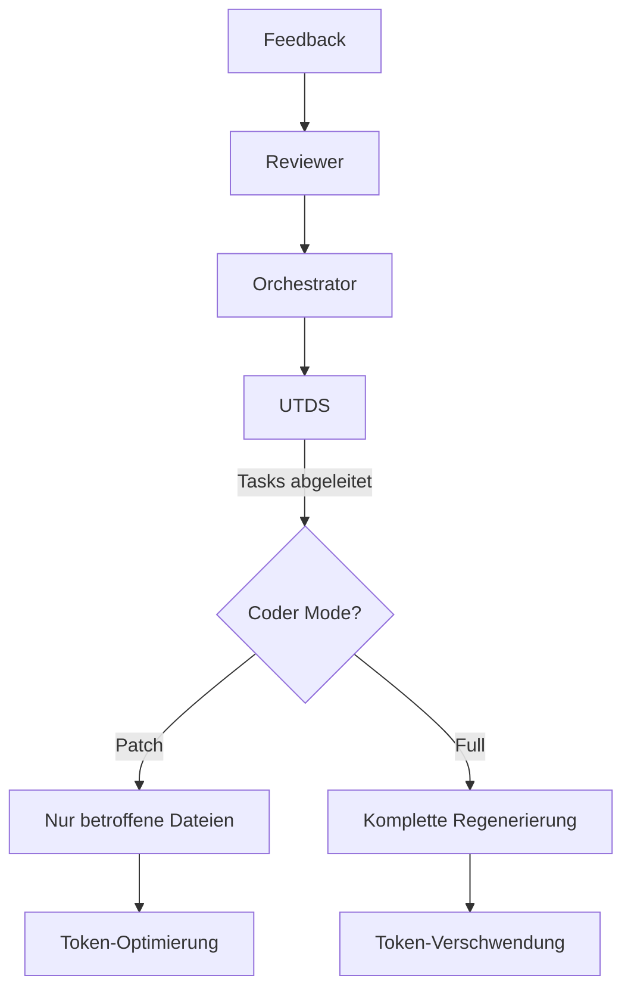
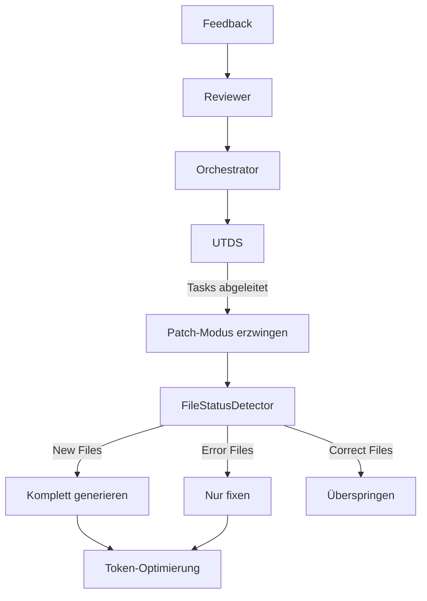

# UTDS-Integration und Code-Regenerierung-Fix

**Author:** rahn
**Datum:** 05.02.2026
**Version:** 1.0

---

## PROBLEMANALYSE

### Symptome
1. **UTDS-Events erscheinen nicht** im globalen Debug-Output-Loop
2. **Coder regeneriert kompletten Code** statt nur betroffene Dateien zu fixen
3. **Massive Token-Verschwendung** (2.93M Tokens pro Iteration)

### Ursachen

#### 1. Logging-Problem in UTDS
In `backend/dev_loop_task_derivation.py` werden Events via `_emit_event()` geloggt, aber:
- Die Methode `_log()` ruft `manager._ui_log()` auf
- **ABER**: Events werden nicht im `server_output.log` geschrieben
- Der globale Output-Loop ist nicht konfiguriert, UTDS-Events zu empfangen

#### 2. Coder-Modus-Entscheidung
In `backend/dev_loop_coder.py:234-269`:
```python
if feedback and _is_targeted_fix_context(feedback):
    # Patch-Modus: Nur betroffene Dateien
    ...
else:
    # FullMode: Komplette Regenerierung
    manager._ui_log("Coder", "FullMode",
        "Kein gezielter Fehler-Kontext erkannt - vollständige Regenerierung")
```

**Problem**: Wenn `_is_targeted_fix_context()` False zurückgibt, wird FullMode aktiviert.

#### 3. Code-Duplikation in `_is_targeted_fix_context`
In `dev_loop_coder.py:124-129` gibt es einen Bug:
```python
    feedback_lower = feedback.lower()
    return any(ind.lower() in feedback_lower for ind in fix_indicators)


    feedback_lower = feedback.lower()  # UNERREICHBAR!
    return any(ind.lower() in feedback_lower for ind in fix_indicators)
```

### Architektur-Problem

```
[Feedback] → [Orchestrator] → [UTDS Task Derivation]
                                    ↓
                            [Tasks ableiten]
                                    ↓
                            [Coder Prompt] ← PROBLEM: Vollständiger Code
                                    ↓
                            [Coder] → [Vollständige Regenerierung]
```

---

## LÖSUNGSANSÄTZE

### Lösung 1: UTDS-Tasks als Patch-Modus-Trigger (EMPFOHLEN)

**Prinzip**: Wenn UTDS Tasks ableitet, soll der Coder automatisch in den Patch-Modus wechseln.

**Änderungen**:
1. `DevLoopTaskDerivation.process_feedback()` soll merken, ob Tasks abgeleitet wurden
2. `DevLoop` soll diese Information an `build_coder_prompt()` weitergeben
3. `_is_targeted_fix_context()` soll UTDS-Tasks als Indikator erkennen

### Lösung 2: Code-Status-Erkennung

**Prinzip**: Unterscheiden zwischen:
- **NEUE Dateien**: Werden komplett generiert
- **FEHLERHAFTE Dateien**: Nur diese werden gefixt
- **KORREKTE Dateien**: Übersprungen

**Änderungen**:
1. `FileStatusDetector` Klasse erstellen
2. Prüfung ob Dateien existieren und fehlerfrei sind
3. Nur fehlerhafte Dateien im Patch-Modus anbieten

### Lösung 3: UTDS-Logging in globalen Loop

**Prinzip**: UTDS-Events sollen im `server_output.log` und Frontend erscheinen.

**Änderungen**:
1. `_emit_event()` soll auch `server_runner.py` Events senden
2. Event-Typen: `DerivationStart`, `TasksDerived`, `BatchExecution*`, `DerivationComplete`

---

## GEPLANTE ÄNDERUNGEN

### Phase 1: Logging-Fix

#### 1.1 `_emit_event()` erweitern
```python
def _emit_event(self, event_type: str, data: Dict[str, Any]) -> None:
    """
    Sendet strukturiertes WebSocket Event an Frontend UND globalen Output-Loop.
    """
    event_data = json.dumps(data, ensure_ascii=False, default=str)
    
    # UI-Log
    self._log("UTDS", event_type, event_data)
    
    # Global Output Loop - HIERarchisch
    try:
        from backend.session_manager import get_session_manager
        sm = get_session_manager()
        if hasattr(sm, 'broadcast_event'):
            sm.broadcast_event("utds", event_type, event_data)
    except Exception:
        pass
```

### Phase 2: TargetedFix → UTDS Integration

#### 2.1 Bug in `_is_targeted_fix_context()` beheben
```python
def _is_targeted_fix_context(feedback: str) -> bool:
    """
    Prüft ob Feedback auf einen gezielten Fix oder additive Änderung hinweist.
    """
    if not feedback:
        return False

    fix_indicators = [...]
    additive_indicators = [...]

    feedback_lower = feedback.lower()
    return (any(ind.lower() in feedback_lower for ind in fix_indicators) or
            any(ind.lower() in feedback_lower for ind in additive_indicators))
```

#### 2.2 UTDS-Task-Tracking
```python
class DevLoopTaskDerivation:
    def __init__(self, manager, config):
        ...
        # Track ob UTDS in dieser Iteration aktiv war
        self._last_iteration_tasks = 0
    
    def has_active_tasks(self, iteration: int) -> bool:
        """Prüft ob UTDS für diese Iteration Tasks abgeleitet hat."""
        return self._last_iteration_tasks > 0
```

#### 2.3 Coder-Prompt mit UTDS-Tasks
```python
def build_coder_prompt(manager, user_goal: str, feedback: str, iteration: int) -> str:
    ...
    # UTDS-Tasks im Prompt
    if hasattr(manager, '_task_derivation'):
        td = manager._task_derivation
        if td.has_active_tasks(iteration):
            # Patch-Modus erzwingen
            patch_mode = True
            manager._ui_log("Coder", "UTDSMode",
                "UTDS-Tasks erkannt - Patch-Modus aktiv")
```

### Phase 3: Code-Status-Erkennung

#### 3.1 FileStatusDetector
```python
class FileStatusDetector:
    """Erkennt ob Dateien NEU, FEHLERHAFT oder KORREKT sind."""
    
    def __init__(self, project_path: str):
        self.project_path = project_path
    
    def get_file_status(
        self, 
        current_code: Dict[str, str], 
        error_files: List[str] = None
    ) -> Dict[str, str]:
        """
        Gibt Status pro Datei zurück: 'new', 'error', 'correct'
        """
        status = {}
        for filepath in current_code:
            full_path = os.path.join(self.project_path, filepath)
            
            if not os.path.exists(full_path):
                status[filepath] = 'new'
            elif error_files and filepath in error_files:
                status[filepath] = 'error'
            else:
                status[filepath] = 'correct'
        
        return status
    
    def get_files_to_patch(self, current_code: Dict[str, str], error_files: List[str]) -> List[str]:
        """
        Gibt nur die Dateien zurück, die tatsächlich gefixt werden müssen.
        """
        files_to_patch = []
        
        for filepath in current_code:
            full_path = os.path.join(self.project_path, filepath)
            
            # Neue Dateien: Include
            if not os.path.exists(full_path):
                files_to_patch.append(filepath)
            # Fehlerhafte Dateien: Include
            elif error_files and filepath in error_files:
                files_to_patch.append(filepath)
            # Korrekte Dateien: Überspringen
        
        return files_to_patch
```

### Phase 4: Integration

#### 4.1 DevLoop Integration
```python
def run(self, user_goal, project_rules, ...):
    ...
    # Nach UTDS-Verarbeitung: Dateien für Patch-Modus bestimmen
    if hasattr(manager, '_task_derivation') and manager._task_derivation.has_active_tasks(iteration):
        detector = FileStatusDetector(manager.project_path)
        affected_files = detector.get_files_to_patch(
            manager.current_code or {},
            error_files=created_files  # Aus Review
        )
        
        if affected_files:
            manager._ui_log("DevLoop", "PatchFiles", 
                f"Patch-Dateien: {len(affected_files)} Dateien")
```

---

## Mermaid: Aktueller vs. Ziel-Workflow

### Aktuell (Problem)


### Ziel


---

## DATEIÄNDERUNGEN

| Datei | Änderung | Priorität |
|-------|----------|-----------|
| `backend/dev_loop_task_derivation.py` | `_emit_event()` erweitern | Hoch |
| `backend/dev_loop_coder.py` | Bug in `_is_targeted_fix_context()` beheben | Hoch |
| `backend/dev_loop_coder.py` | UTDS-Task-Tracking | Hoch |
| `backend/dev_loop.py` | FileStatusDetector Integration | Mittel |
| `backend/` | `file_status_detector.py` erstellen | Mittel |

---

## ERWARTETES ERGEBNIS

1. **UTDS-Events** erscheinen im Debug-Output
2. **Coder** nutzt Patch-Modus wenn UTDS aktiv war
3. **Nur fehlerhafte Dateien** werden regeneriert
4. **Token-Verbrauch** reduziert um ~70-90%
5. **Keine unnötigen Dateien** werden überschrieben

---

## TEST-VALIDIERUNG

Nach den Änderungen:
1. Unit-Tests für `FileStatusDetector`
2. Integrationstest für UTDS → Coder Kommunikation
3. E2E-Test: Verifiziere keine vollständige Regenerierung, wenn nur wenige Dateien Fehler haben
